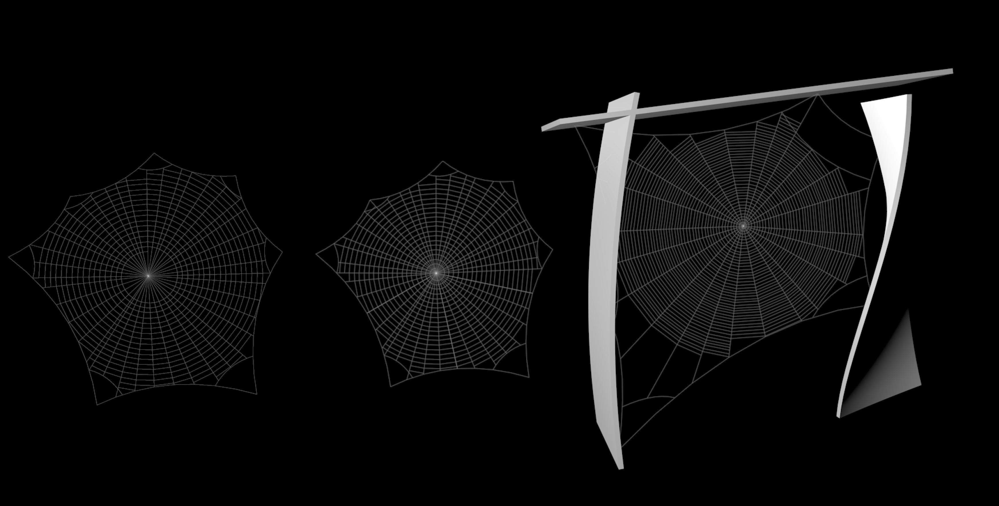

# SpiderWeb

An update to this fine Python Cinema 4D plugin.

Tested and works with Cinema 4D R26 on Macintosh.

Updated various Python 2 -> Python 3 upgrade issues, mainly `xrange` to `range` and perhaps a couple of other bits (max size of integers, I think).

I noticed that the original generator only worked when ray casting with parametric objects, not polygon objects.

So I changed the modelling command used to process the objects being used for the ray cast tests from `c4d.MCOMMAND_MAKEEDITABLE` to `c4d.MCOMMAND_CURRENTSTATETOOBJECT`, which means it no longer skips polygon objects.

This also means that deformers are more completely supported. (Before, deformers applied to objects you wanted to test against were ignored, now they are not, although admittedly I’ve not tested this exhaustively.)

There’s a new test document (`spiderweb-test-scene.c4d`) with three different ways of using the plugin set up.

## Original README

Cinema 4D's plugin. 

WIP

SpiderWeb allow you to create ... spiders web 

